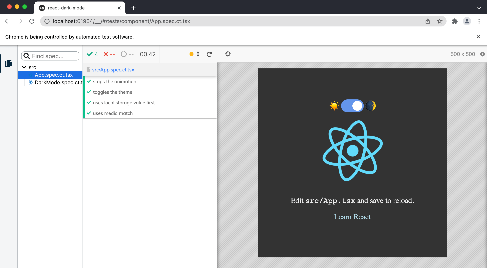

# Component Testing for React Dark Mode app [](https://github.com/bahmutov/react-dark-mode/actions/workflows/ci.yml)

The application was described in the blog post [How to Create a Dark Mode Component in React](https://dev.to/alexeagleson/how-to-create-a-dark-mode-component-in-react-3ibg#adding-tests-optional). This repo is a fork with added [Cypress Component tests](https://on.cypress.io/component-testing).



Repo [bahmutov/react-dark-mode](https://github.com/bahmutov/react-dark-mode)

## Videos

- [Stop CSS Animation In A Component Test](https://youtu.be/VtIvGznpo_A)
- [Using Cypress Component Testing To Really Test A React Dark Mode Component](https://youtu.be/VdyZonBAeLw)

## Run

```
yarn install
yarn cypress open-ct
```

## Tests

See [DarkMode.spec.ct.tsx](./src/DarkMode.spec.ct.tsx) and [App.spec.ct.tsx](./src/App.spec.ct.tsx)
